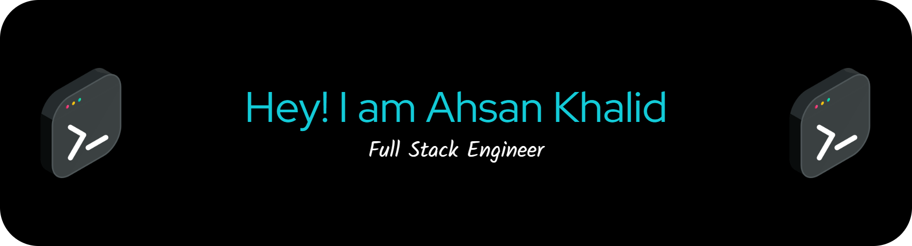

<h3 align="center">
Full Stack Product Engineer • AI Systems • SaaS Architecture • Automation Infrastructure
</h3>

Building AI-native SaaS systems, scalable automation platforms, and production-grade web applications using modern technologies.

---

## 🧠 About Me

🥷 Full Stack Product Engineer specializing in AI-native SaaS systems, automation infrastructure, and scalable multi-tenant platforms. 
🚀 Currently building production-grade applications using Next.js, TypeScript, PostgreSQL, Redis, and modern AI workflows. 
⚡ Experienced in scalable backend architectures, distributed job processing, AI orchestration, and enterprise SaaS systems. 
🏗️ Strong focus on system design, developer experience, product ownership, and performance-oriented engineering. 
🤝 Open to collaborating on impactful products, startup engineering, AI systems, and large-scale SaaS platforms. 
💬 Feel free to ask me about Next.js, SaaS architecture, backend systems, AI workflows, scalability, or modern web engineering. 

## 🚀 Currently Working On

- AI-driven automation systems
- Distributed queue & worker architectures
- Multi-tenant SaaS platforms
- Enterprise-grade Next.js applications
- Backend scalability & observability
- AI-assisted engineering workflows

---

## 🌟 Featured Engineering Projects

### 🤖 AI Automation System Design
Scalable AI orchestration platform featuring distributed workers, queue-driven processing, webhook ingestion, retry/idempotency workflows, and observability-focused architecture.

### 🏢 Multi-Tenant SaaS Architecture
Production-inspired SaaS architecture featuring RBAC/RLS authorization, tenant isolation, scalable dashboards, role management, and backend infrastructure patterns.

### ⚙️ Enterprise Next.js Starter
Production-ready Next.js architecture including authentication, permissions, server actions, queue workflows, scalable folder structures, and modern SaaS engineering patterns.

📦 More Engineering Interests

 

- Distributed systems & event-driven architectures  
- AI-assisted engineering workflows  
- Backend scalability & observability  
- Queue & worker orchestration systems  
- Fintech & payments infrastructure  
- Developer experience & system design  
- Production-grade SaaS engineering  

---
# 🤖 OpenSource - GSSOC 2024 🪶

# 🤖 OpenSource - HacktoberFest (2023 - 2024)

 
 

---
## 🌐 Connect With Me

  
  
  

  

  

  

---

## 🛠️ Tech Stack

### 🚀 Frontend

  

### ⚙️ Backend & Infrastructure

  

### ☁️ Cloud & DevOps

  
  
  
  

### 🧠 Tools & Workflow

  

---
# 💎 Problem Solving Stats:
  

<table align="center">
<tr border="none">
<td width="50%" align="center">

 
</td>
<td width="50%" align="center">

  

  </td>
 
</tr>
</table>

#  GitHub Stats:

<table align="center">
<tr border="none">
<td width="50%" align="center">

  
    
   
</td>
<td width="50%" align="center">

  

  </td>
  <tr>
  <td colspan="2"  align="center">
  
  </td>
  </tr>
</tr>
</table>

## 🏆 GitHub Trophies

  

---

